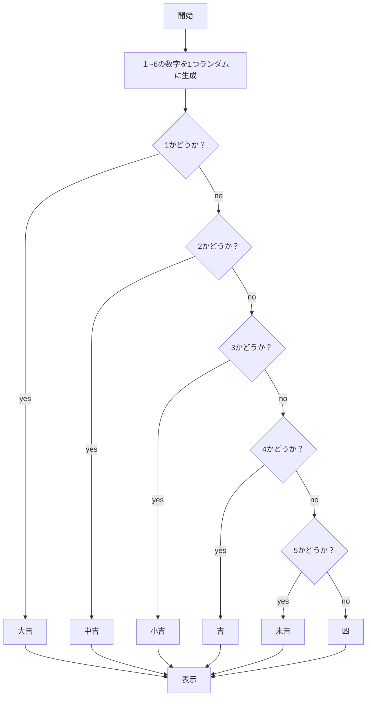
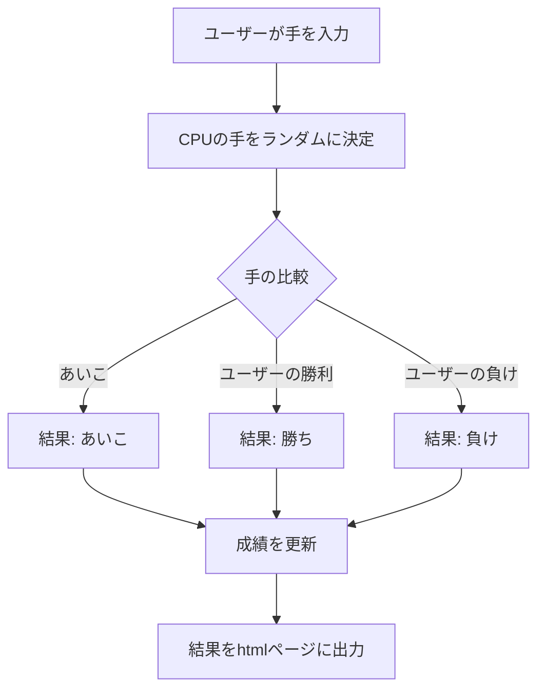
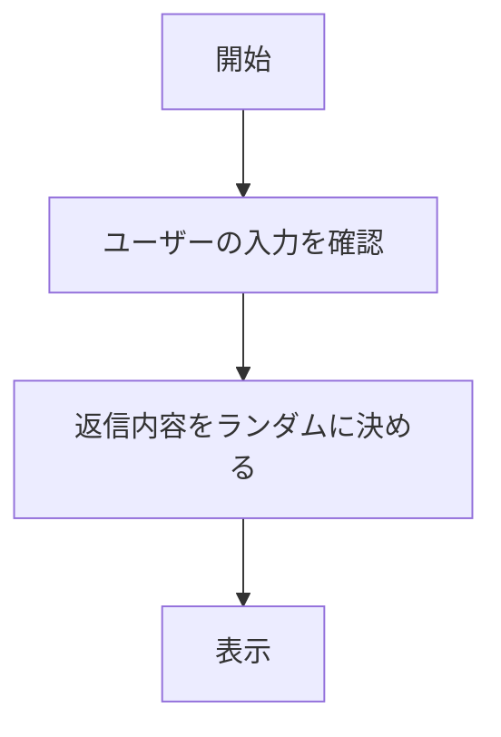

# webpro_06

## app5.jsの説明

ファイル名 | 説明
-|-
app5.js | いくつかのルートのあるプログラム

| **app5.jsのルート**         | **機能**                                                | **変数 / 渡されるデータ**              | **表示されるもの**    |
|-----------------------|--------------------------------------------------------|---------------------------------------|-------------------------|
| `/hello1`             | 2つの異なる挨拶メッセージを表示する．                 | `greet1: "Hello world"`, `greet2: "Bon jour"` | `show`                  |
| `/hello2`             | デフォルトの挨拶メッセージを表示する．                 | `greet1: "Hello world"`, `greet2: "Bon jour"` | `show`                  |
| `/icon`               | アイコン（Appleのロゴ）を表示する．                  | `filename: "./public/Apple_logo_black.svg"`, `alt: "Apple Logo"` | `icon`                  |
| `/luck`               | ランダムな運勢を表示する（例：大吉、中吉）．           | `number: ランダムな数字`, `luck: 運勢` | `luck`                  |
| `/janken`             | じゃんけん（グー、チョキ、パー）をし，勝敗判定を行う． | `your: 手`, `cpu: コンピュータの手`, `judgement: 結果`, `win: 勝利数`, `total: 総回数` | `janken`                |
| `/count`              | 入力された文字列の長さを表示する．                    | `input: ユーザーの入力`, `length: 入力文字列の長さ` | `count`                 |
| `/random-reply`       | ユーザーの入力に対してランダムな返信を返する．        | `userInput: 入力されたテキスト`, `randomReply: ランダムな返信` | 特定のビューはなく、直接HTMLを返す |

### /hello1の詳細

定義していたmessage1 "Hello world"とmessage2"Bon jour"を表示する.

### /hello1の起動方法
1. app5.js を起動する
1. Webブラウザでlocalhost:8080/hello1にアクセスする

### /hello2の詳細
hello1と違い，変数を定義せず，res.render内で直接文字列を渡している.

###　/hello2の起動方法
1. app5.js を起動する
1. Webブラウザでlocalhost:8080/hello2にアクセスする

### /iconの詳細
２つのデータ(filename: ./public/Apple_logo_black.svg(画像へのパス) とalt: "Apple Logo"代替テキスト)が渡され，
通常，画像(filename)が表示される．もし表示されないときは代替テキスト(alt)が表示される．

###　/iconの起動方法
1. app5.js を起動する
1. Webブラウザでlocalhost:8080/iconにアクセスする

###　/luckの詳細
乱数生成をし，生成された整数によって特定のテキストを返す．具体的な処理は下のフローチャートに示す．

###　/luckの起動方法
1. app5.js を起動する
1. Webブラウザでlocalhost:8080/luckにアクセスする

### /jankenの詳細

ユーザーがじゃんけんの手を入力し，その後，１〜３の数字をランダムに生成する．
1. '1'= グー
1. '2'= 　チョキ
1. '3'=　　パー
とし，生成された整数によりcpuの手が決まる．それをユーザーの入力と比較し，勝敗判定をして結果出力する．

###　/jankenの起動方法
1. app5.js を起動する
1. Webブラウザでlocalhost:8080/jankenにアクセスする

### /countの詳細
ユーザーが入力した文字列を受け取り，その文字列の長さを計算する．
ユーザーが入力した文字列と文字列の長さを計算結果を表示する．

###　/countの起動方法
1. app5.js を起動する
1. Webブラウザでlocalhost:8080/countにアクセスする
1. 好きな文字を入力

### /random-replyの詳細
ユーザーが文字列を入力
返信をランダムえらぶ
出力内容は，
1. "こんにちは！",
1.    "どうしたの？",
1.    "元気ですか？",
1.    "いいですね！",
1.   "そうなんですね！"
の5パターンである．

###　/random-replyの起動方法
1. app5.js を起動する
1. Webブラウザでlocalhost:8080/random-replyにアクセスする
1. 好きな文字を入力

