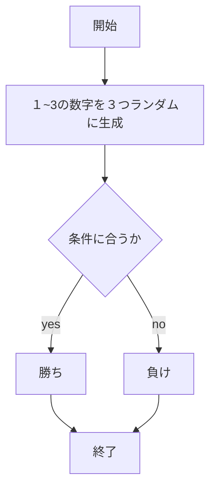

# webpro_06

## app.jsの説明

ファイル名 | 説明
-|-
app5.js | プログラム本体

| **ルート**         | **機能**                                                | **変数 / 渡されるデータ**              | **表示されるビュー**    |
|-----------------------|--------------------------------------------------------|---------------------------------------|-------------------------|
| `/hello1`             | 2つの異なる挨拶メッセージを表示する．                 | `greet1: "Hello world"`, `greet2: "Bon jour"` | `show`                  |
| `/hello2`             | デフォルトの挨拶メッセージを表示する．                 | `greet1: "Hello world"`, `greet2: "Bon jour"` | `show`                  |
| `/icon`               | アイコン（Appleのロゴ）を表示する．                  | `filename: "./public/Apple_logo_black.svg"`, `alt: "Apple Logo"` | `icon`                  |
| `/luck`               | ランダムな運勢を表示する（例：大吉、中吉）．           | `number: ランダムな数字`, `luck: 運勢` | `luck`                  |
| `/janken`             | じゃんけん（グー、チョキ、パー）をし，勝敗判定を行う． | `your: 手`, `cpu: コンピュータの手`, `judgement: 結果`, `win: 勝利数`, `total: 総回数` | `janken`                |
| `/count`              | 入力された文字列の長さを表示する．                    | `input: ユーザーの入力`, `length: 入力文字列の長さ` | `count`                 |
| `/random-reply`       | ユーザーの入力に対してランダムな返信を返する．        | `userInput: 入力されたテキスト`, `randomReply: ランダムな返信` | 特定のビューはなく、直接HTMLを返す |

##　/hello1の起動方法
1. app5.js を起動する
1. Webブラウザでlocalhost:8080/hello1にアクセスする
1. 自分の手を入力する

##　/hello2の起動方法
1. app5.js を起動する
1. Webブラウザでlocalhost:8080/hello2にアクセスする
1. 自分の手を入力する

##　/iconの起動方法
1. app5.js を起動する
1. Webブラウザでlocalhost:8080/iconにアクセスする
1. 自分の手を入力する

##　/luckの起動方法
1. app5.js を起動する
1. Webブラウザでlocalhost:8080/luckにアクセスする
1. 自分の手を入力する

##　/jankenの起動方法
1. app5.js を起動する
1. Webブラウザでlocalhost:8080/jankenにアクセスする
1. 自分の手を入力する
##　/countの起動方法
1. app5.js を起動する
1. Webブラウザでlocalhost:8080/countにアクセスする
1. 自分の手を入力する
##　random-reply/の起動方法
1. app5.js を起動する
1. Webブラウザでlocalhost:8080/random-replyにアクセスする
1. 自分の手を入力する

